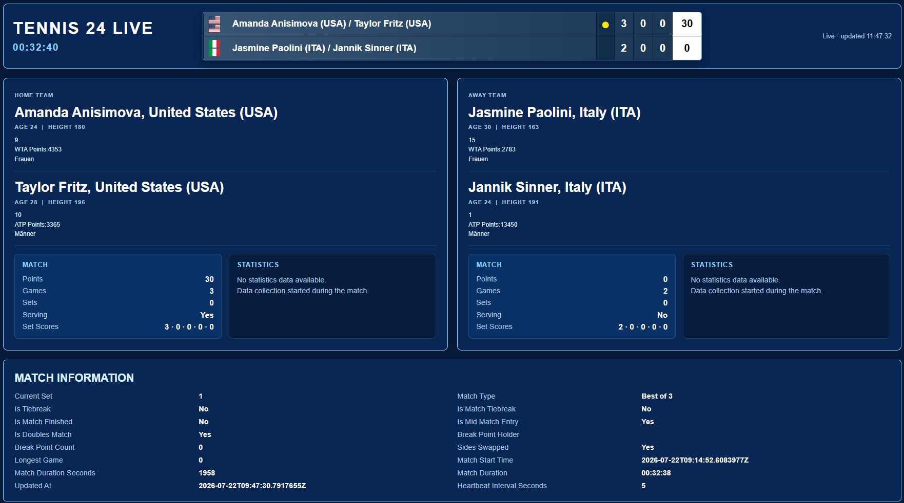

# Tennis Live Server

A small Python/Flask app that reads the current match state written by Tennis26 and serves it over the local network — as a live HTML view and as a JSON feed (e.g. for a vMix Data Source, a web overlay, or a scoreboard).

It runs as a separate process from Tennis26. If it crashes or is restarted, Tennis26's scoring and vMix control keep working independently.



## Folder contents

```
tennis_live_server.py           The Flask server
start_tennis_live_server.bat    Double-click to start the server
static/index.html               The live HTML view served at "/"
install/
├── install_python_env.ps1      One-time setup script (Python + packages)
├── requirements.txt            Pinned package versions (Flask, psutil)
├── venv/                       Created by the install script — the local Python environment
└── README.md                   Details about the install script
```

## First-time setup

The server needs Python 3.12 plus the `Flask` and `psutil` packages. Rather than installing these system-wide, an installer script sets up a local, self-contained Python environment inside `install\venv`, used only by this project.

1. Open this folder (`C:\tennis_live_server`, or wherever you placed it) in File Explorer.
2. Right-click inside the folder and choose **"Open in Terminal"** (or open PowerShell and `cd` into this folder).
3. Run:

   ```powershell
   powershell -ExecutionPolicy Bypass -File .\install\install_python_env.ps1
   ```

4. The script will:
   - Check whether Python 3.12 is already installed.
   - If not, install it via `winget` (Windows' built-in package manager).
   - Create a local virtual environment at `install\venv`.
   - Install `Flask` and `psutil` into that environment (versions pinned in `install\requirements.txt`).

**Do you need to run PowerShell as Administrator?** No — a regular (non-elevated) PowerShell window is enough. If Python still needs to be installed, Windows or `winget` may pop up its own confirmation/UAC prompt during that step — just accept it when it appears. You don't need to launch the terminal itself as Administrator beforehand.

You only need to do this once. If you later add new Python packages to the project, add them to `install\requirements.txt` and re-run the script — it will update the existing environment instead of recreating it from scratch.

## Starting the server

Once the one-time setup above has completed, just double-click:

```
start_tennis_live_server.bat
```

This opens a console window and starts the server. Leave that window open while broadcasting — closing it stops the server. It automatically uses the Python environment installed under `install\venv` if present, and falls back to a system-wide `python` otherwise.

## Using it

Once running, from any device on the same network:

| URL | Purpose |
|---|---|
| `http://<LAN-IP>:42100/` | Live HTML view of the current match (score, server, statistics) |
| `http://<LAN-IP>:42100/tennis24_live.json` | Raw JSON feed of the match state (CORS-enabled, e.g. for a vMix Data Source) |
| `http://<LAN-IP>:42100/health` | Simple status check |

Replace `<LAN-IP>` with this machine's IP address on your local network (or use `localhost` when browsing on the same machine).

## Configuration

Two paths are hardcoded near the top of `tennis_live_server.py`:

```python
DATA_FILE = Path(r"C:\vmix\tennis\data\tennis24_live.json")
FLAGS_DIR = Path(r"C:\vmix\tennis\flags")
```

These point at the match-state file and country flag images that Tennis26 writes to / reads from. If your `vmix\tennis` folder lives somewhere other than `C:\vmix\tennis`, update these two paths before starting the server. `DATA_FILE` does not need to exist yet when the server starts — it will simply show "waiting for data" until Tennis26 writes it.

The server listens on port `42100` (`PORT` constant near the top of the script) — change it there if that port is already in use on your machine.
